<div align="center">

<!--
  BOOT SEQUENCE — a fake terminal init log rendered via
  readme-typing-svg. Monospace, dark terminal palette (charcoal
  bg, sand text) so it reads as an actual shell, not a banner.
  Purely decorative — no real system runs this.
-->


</div>

<br />

<div align="center">

<!--
  ============================================================
  BANNER IMAGE — insert your custom banner here.
  Recommended size: 1600×400px (or 1200×300px minimum)
  Suggested style: warm sand/ivory gradient background,
  charcoal serif or geometric-sans wordmark, generous
  negative space — no clutter, no icons crowding the edges.
  Replace the src below with your hosted banner path,
  e.g. assets/banner.png inside this repository, or an
  image hosted on your own domain (tanush.site/banner.png).
  ============================================================
-->


<br />

<!-- ============================================================
     TYPING HERO — animated subtitle via readme-typing-svg
     Palette: ivory background / taupe text to match the
     warm-sand theme used throughout this README.
     ============================================================ -->
<a href="#">
  
</a>

<br /><br />

# TANUSH MISHRA

**AI Builder&nbsp;&nbsp;·&nbsp;&nbsp;Full Stack Developer&nbsp;&nbsp;·&nbsp;&nbsp;Product Creator**

<sub>Noida, Uttar Pradesh, India &nbsp;—&nbsp; B.Tech CSE @ Jaypee Institute of Information Technology</sub>

<br />


<br /><br />


</div>

<br />

<!-- ============================================================
     SIGNATURE ELEMENT — animated orbit (assets/orbit.svg)
     Three rings rotate at different speeds: inner = core stack,
     mid = AI layer, outer = product/startup layer. Pure SMIL
     animation inside a static SVG file, so it animates natively
     wherever GitHub renders  — no JS required.
     ============================================================ -->
<div align="center">

</div>

<br />

## Building products at the intersection of AI, software, and design.

I design and ship AI-powered products, modern web platforms, and scalable systems — from first line of code to production deployment. My work sits at the intersection of automation, intelligent systems, and thoughtful product design.

<br />

<div align="center">

### Currently Building

</div>

<table align="center">
<tr>
<td width="50%" valign="top">

**🌾 Edge-AI Smart Agriculture Copilot**
<br />An offline-capable, computer-vision-driven advisory platform for farmers.

**🤖 AI Chatbots & Automation Systems**
<br />Retrieval-augmented assistants and workflow automation for businesses.

</td>
<td width="50%" valign="top">

**🧱 Full-Stack SaaS Products**
<br />End-to-end platforms — design, backend, deployment.

**🌐 Modern Web Experiences & Digital Ventures**
<br />Editorial-grade websites and personal/brand portfolios.

</td>
</tr>
</table>

<div align="center">

**Currently learning** — Advanced AI Systems · Computer Vision · Edge AI · System Design · Product Development

</div>

<br />

<div align="center">

</div>

<br />

## About Me

- 🎓 Second-year **Computer Science Engineering** student at **JIIT Noida**
- 🧠 Deeply invested in **AI, software engineering, startups, and digital products**
- 🛠️ I enjoy taking products from **concept → deployment**, not just writing code
- ⚙️ Focused on **automation, intelligent systems, and scalable software architecture**
- 🎨 I like combining **technology, design, and business** into one coherent product vision
- 🚀 Actively building ventures and projects beyond the classroom — treating every repo like a real product

<br />

<div align="center">

</div>

<br />

<div align="center">

## Featured Ventures & Websites

</div>

<table align="center" width="100%">
<tr>
<td align="center" width="33%">

### Portfolio
Personal portfolio showcasing projects, skills, and professional journey.

<a href="https://tanush.site">

</a>

</td>
<td align="center" width="33%">

### MM Productions
Premium movie production and entertainment website.

<a href="https://mmproductions.in">

</a>

</td>
<td align="center" width="33%">

### KAER
Digital solutions marketplace — websites, AI chatbots, and automation systems.

<a href="https://kaer.site">

</a>

</td>
</tr>
</table>

<div align="center">

<!--
  LIVE STATUS — shields.io "website" badges ping each URL at
  render time, so these reflect real uptime, not a static label.
-->
<sub>Live status</sub>
<br />


</div>

<br />

<div align="center">

</div>

<br />

<div align="center">

## Technical Stack

</div>

<div align="center">

<!--
  PROFICIENCY — assets/skill-bars.svg. Static, hand-set values
  (self-assessed), not pulled from an API. Update the percentages
  in the SVG directly as skills develop.
-->


</div>

<br />

<div align="center">

**Programming Languages**


<br /><br />

**Frontend**


<br /><br />

**Backend**


<br /><br />

**Tools**


<br /><br />

**Design & Creative**


</div>

<br />

<div align="center">

</div>

<br />

<div align="center">

## AI & Emerging Technologies

*Designing systems that see, reason, and act — from edge devices to the cloud.*


</div>

<br />

<div align="center">

</div>

<br />

<div align="center">

## Featured Projects

</div>

<table align="center" width="100%">
<tr>
<td width="50%" valign="top">

```
● ● ●  inventory-management/
```

**📦 Inventory Management System**
<br />A scalable inventory management platform built in **C**, featuring authentication, CRUD operations, CSV persistence, sorting, searching, reporting, and efficient data handling.

`C` `CSV` `CLI Architecture`

</td>
<td width="50%" valign="top">

```
● ● ●  edge-ai-agriculture/
```

**🌾 Edge-AI Smart Agriculture Copilot**
<br />An AI-powered agriculture platform combining computer vision, hyper-local intelligence, ROI optimization, and offline capabilities to improve farming decisions.

`Computer Vision` `Edge AI` `TensorFlow Lite`

</td>
</tr>
<tr>
<td width="50%" valign="top">

```
● ● ●  hezkue-assistant/
```

**💬 Hezkue AI Assistant**
<br />A business-focused AI assistant integrating retrieval systems, automation workflows, and intelligent customer interactions.

`RAG` `Automation` `AI Assistant`

</td>
<td width="50%" valign="top">

```
● ● ●  cricket-scorecard/
```

**🏏 Cricket Scorecard System**
<br />A modern cricket scoring application developed using **C++** and the STL.

`C++` `STL` `Systems Design`

</td>
</tr>
</table>

<br />

<div align="center">

</div>

<br />

<div align="center">

## Certifications

<table>
<tr>
<td align="center" width="33%">

**IBM**
<br />AI Fundamentals

</td>
<td align="center" width="33%">

**HackerRank**
<br />SQL (Intermediate)

</td>
<td align="center" width="33%">

**Quantium**
<br />Data Analytics Job Simulation

</td>
</tr>
</table>

</div>

<br />

<div align="center">

</div>

<br />

<div align="center">

## GitHub Statistics

<!--
  Beige-compatible theme note:
  github-readme-stats does not ship a native "beige" preset, so
  custom hex parameters are used below to match the warm-sand
  palette (ivory bg / taupe icons / charcoal text).
  Closest built-in fallback themes if you prefer presets:
  "gruvbox", "vue", or "buefy" — all lean warm/neutral.

  Self-hosted instance: these cards point to a personal Vercel
  deployment (github-readme-stats-orpin-seven-77.vercel.app)
  rather than the public github-readme-stats.vercel.app, which
  is shared by thousands of profiles and frequently rate-limited
  or unreliable. If this deployment is ever redeployed under a
  new URL, update both  src values below to match.
-->


<br /><br />


<br /><br />

<!--
  TROPHIES — github-profile-trophy renders earned achievement
  tiles (commit streaks, stars, PRs, etc.) as they're unlocked.
  "onedark" is the closest built-in theme to the warm-charcoal
  palette; there's no native beige preset for this widget.
-->


<br /><br />


<br /><br />

<!--
  WAKATIME — weekly coding-hours breakdown by language.
  Requires: a WakaTime account (wakatime.com) with the editor
  plugin installed, and BOTH "Display code time publicly" and
  "Display languages, editors, os, categories publicly" toggled
  on in WakaTime settings. Reuses the self-hosted stats instance
  below, so no separate deployment is needed — swap the username
  parameter for your WakaTime username if it differs from GitHub.
-->


</div>

<br />

<div align="center">

</div>

<br />

<div align="center">

## Contribution Activity

<sub>A living trace of daily commits — rendered as a single continuous thread.</sub>

<!--
  Contribution snake — generated by the Platane/snk GitHub Action.
  Workflow: .github/workflows/snake.yml (included in this repo).
  It runs on a schedule, walks a snake across the real contribution
  grid, and publishes the rendered SVG to the "output" branch.
  This  pulls the latest generated frame straight from there.

  Palette below matches the README theme:
    dots   → #DDD0BC (sand)   →  #8C7B6B (taupe)  →  #2B2620 (charcoal)
    snake  → #A99985 (taupe-mid)
    empty  → #FAF7F2 (ivory)
-->
<p align="center">
  <picture>
    <source media="(prefers-color-scheme: dark)" srcset="https://raw.githubusercontent.com/tanushmishra/tanushmishra/output/github-contribution-grid-snake-dark.svg" />
    <source media="(prefers-color-scheme: light)" srcset="https://raw.githubusercontent.com/tanushmishra/tanushmishra/output/github-contribution-grid-snake.svg" />
    
  </picture>
</p>

</div>

<br />

<div align="center">

</div>

<br />

<!--
  TESTIMONIAL — swap this placeholder for a real one- or two-line
  quote from a professor, hackathon judge, or client once you
  have one on record. Keep it short; one strong line beats three
  vague ones.
-->
<div align="center">

<table><tr><td width="700">

<div align="center">

<sub>&#8220;</sub>

*A second-year student who already ships production software and runs three live ventures - that's a rare combination of curiosity and follow-through.*

<sub>&#8221;</sub>

**— A Teammate**

</div>

</td></tr></table>

</div>

<br />

<div align="center">

</div>

<br />

<div align="center">

## Connect With Me

<a href="https://tanush.site">

</a>
<a href="https://instagram.com/realtanush">

</a>
<a href="mailto:tanushmishra.t@gmail.com">

</a>
<!--
  RESUME — replace resume.pdf with the actual path once uploaded
  to this repo (e.g. assets/resume.pdf) or a hosted URL.
-->
<a href="https://raw.githubusercontent.com/tanushmishra/tanushmishra/main/assets/resume.pdf">

</a>

<br /><br />


<br /><br />

<!--
  QR CODE — scannable link to the portfolio, generated on the
  fly by api.qrserver.com (no account/setup needed). Colors are
  URL-encoded hex without '#': charcoal foreground on ivory bg.
-->
<sub>Scan to visit the portfolio</sub>
<br />


</div>

<br />

<div align="center">

</div>

<br />

<div align="center">

<details>
<summary><sub>you scrolled this far — nice</sub></summary>
<br />

If you're reading this, you probably read READMEs the way I read changelogs: all the way to the bottom.

Say hi — <a href="mailto:tanushmishra.t@gmail.com">tanushmishra.t@gmail.com</a>. Bonus points if you mention this line.

</details>

</div>

<br />

<div align="center">

### *Building at the edge of AI, software, and design — one product at a time.*

<sub>© Tanush Mishra — All ventures, all builds, one vision.</sub>

</div>
